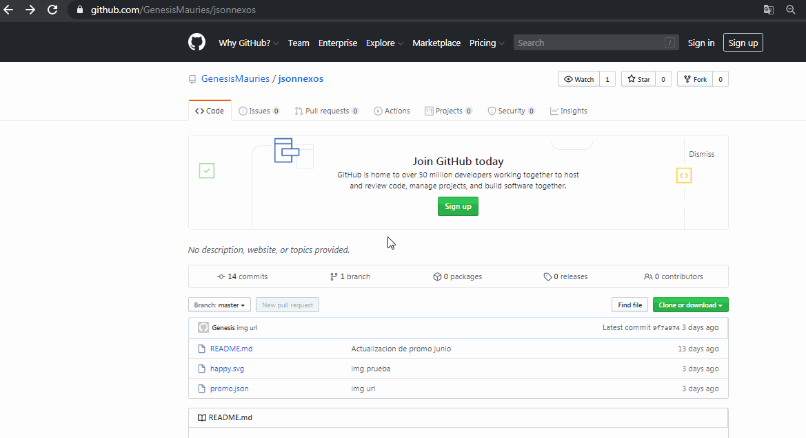
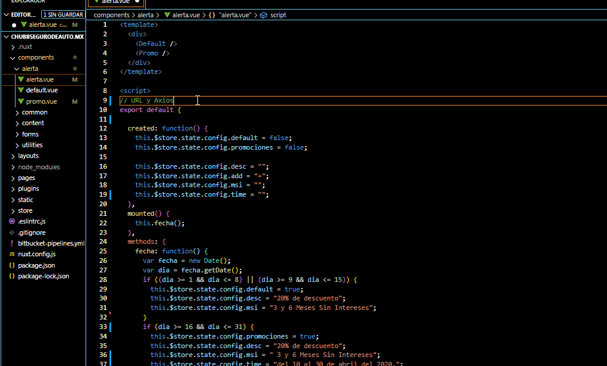
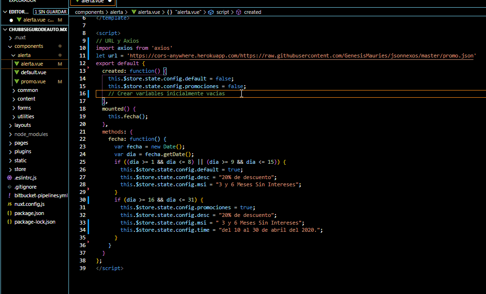
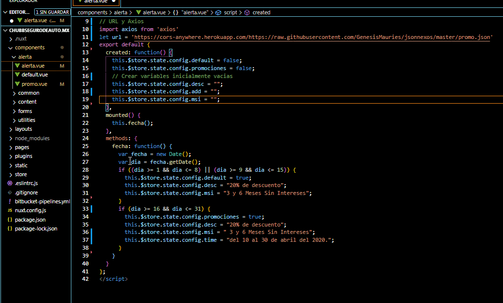
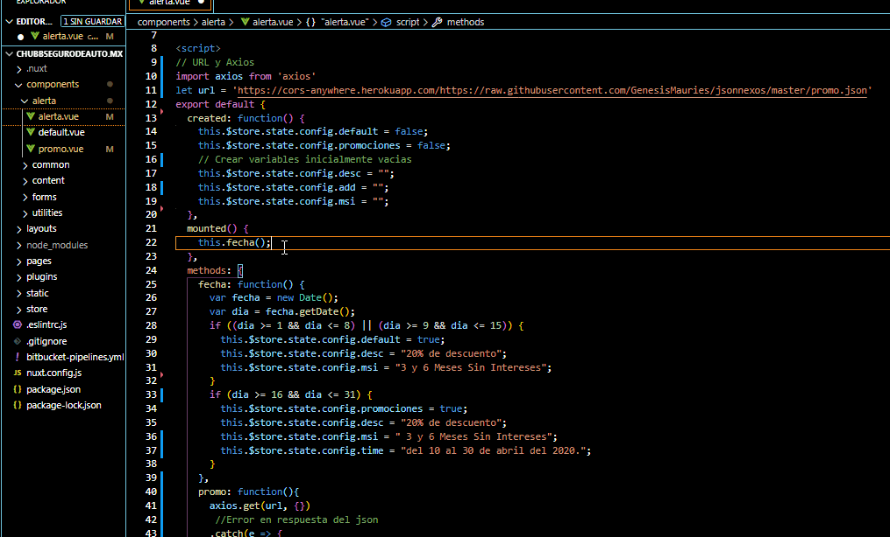
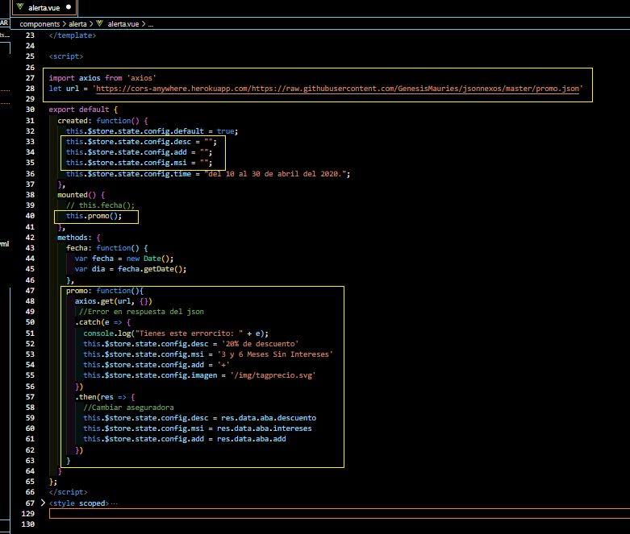

# JSON Promociones
Estructura de objetos para facilitar el cambio y actualizacion de promociones en los diferentes proyectos.
### Aseguradoras
- Aba
- Afirme
- General de seguros
- AIG
- ANA
- Atlas
- AXA
- Potosi
- GNP
- Default
## GUÍA
### Creacion de JSON
Generar un archivo ejemplo.json  y dentro una coleccion de propiedades conformada por el nombre de la __aseguradora__ como valor, el __descuento__ y los __meses sin intereses__ (en diferentes formatos) como propiedades.
```
{
    "aseguradora":{
        "descuento": "Descuento",
        "intereses": " Número más Meses Sin Intereses",
        "msi" : " Número más MSI",
        "meses": " Número más Meses",
        "mes": "Solo número"
    },
    "otraAseguradora":{
        "descuento": "Descuento",
        "intereses": " Número más Meses Sin Intereses",
        "msi" : " Número más MSI",
        "meses": " Número más Meses",
        "mes": "Solo número"
    }
}
```
### Almacenamiento
[Creacion de un repositorio](https://help.github.com/es/github/getting-started-with-github/create-a-repo) en [GitHub](https://github.com/) de forma pública.
### URL
Obtener la URL del archivo JSON alojado en GitHub



### Implementación 
En el componente **alerta.vue** :

- En la parte mas alta del script importar axios y crear una variable con la url del archivo json.



- Declarar variables vacias.



- Dentro de __methods__ crear funcion de peticion y asignacion de valores.



- Por ultimo en __mounted()__ invocamos la funcion anteriormente creada.



### Resultado

El componente terminara con una estructura similar a esta: 



